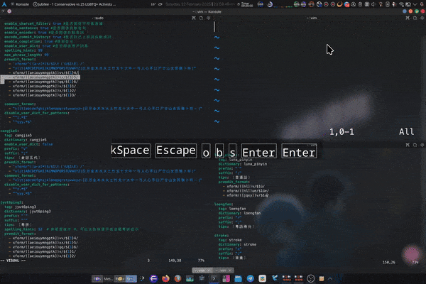
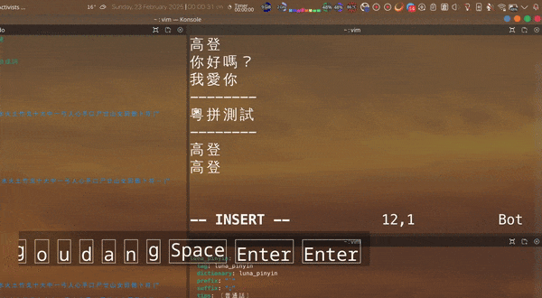
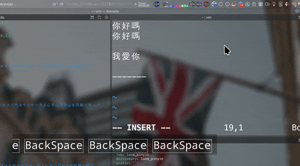

[粵語](README.md) | [English](README-en.md)

<div lang="cmn">

<h1 align="center">Rime 倉頡粵拼混合輸入法</h1>

參考討論可以在高登的這篇文章中找到：[【軟體討論】Linux 高登集中討論(#10)](https://forum.hkgolden.com/thread/7908621/page/4)

## DEMO
[DEMO1&2 | YouTube](https://youtu.be/CPhoTEEFDhI)

[DEMO1&2 | YouTube](https://youtu.be/MAnnJ7BrYOg)

### 【倉頡】DEMO1

### 【粵拼】DEMO2

### 【粵拼快打】DEMO3


## 規劃 / 功能 / 路線圖｜我目前的進度是：
1. <s>預設主要輸入法【倉頡】｜副輸入法【粵拼】</s>
2. <s>可以連續輸入【倉頡/粵拼】碼</s>
3. <s>標點符號優先使用倉頡碼</s>
4. <s>快速輸入【粵拼】</s>
**目前：無法識別複雜詞組/句子**
5. <s>在【倉頡】模式下，直接輸入【粵拼】碼</s>
**目前：無法在此模式下連續輸入粵拼碼**
6. <s>輸入【粵拼】，顯示【倉頡】提示</s>
**目前：僅限於單字**
7. <s>輸入【倉頡】，顯示【粵拼】提示</s>
**目前：無法在詞組句子中顯示提示｜只有單字有提示**
8. **修復並完善功能 <4>**
9. **修復並完善功能 <5>**
10. **修復並完善功能 <6>**
11. **修復並完善功能 <7>**
12. 快速輸入【倉頡】（期望：<i>同時提供【速成倉頡】候選字，即為快倉</i>）
13. 快速輸入【倉頡】的詞組/句子（期望：<i>輸入[你]，提供[你好]等常用候選詞組</i>）
14. 自定義詞庫（讓使用者快速輸入【email、個人資料等】）
15. 輸入英文顯示中文
16. 集成日文輸入
17. 輸入日期與時間

## 以下內容摘自[原始倉頡輸入法庫](https://github.com/rime/rime-cantonese)

<h1 align="center">Rime 粵語拼音方案</h1>

<p align="center">
<a href="https://github.com/rime/rime-cantonese/issues"></a>
<a href="https://github.com/rime/rime-cantonese/releases"></a>


本項目由「粵語計算語言學基礎建設組」([@CanCLID](https://github.com/CanCLID)) 開發及維護，主體部分循「[共享創意-署名-4.0 國際](http://creativecommons.org/licenses/by/4.0/)」協議發佈，`jyut6ping3.maps` 循「[開放資料庫授權-1.0](https://opendatacommons.org/licenses/odbl/)」協議發佈。

<p align="center"><a href="https://github.com/rime/rime-cantonese/releases"></a></p>

如有問題，歡迎加入下述 [Telegram 交流組](https://t.me/rime_cantonese)尋求協助。

---

配方：℞ `cantonese`

`jyut6ping3` 是聲調顯示版方案，`jyut6ping3_ipa` 是 IPA 顯示版方案。

**碼表收音收字詞條問題反饋**：[](https://forms.gle/83cVEAiahr9wjyyq6) [](https://wj.qq.com/s2/7613837/0794)

**Telegram 用户交流組**：[](https://t.me/rime_cantonese)

**拼音方案**

- 本方案**僅**支援「香港語言學學會粵語拼音方案」（簡稱「**粵拼**」）：
  - [Jyutping 粵拼 | lshk](https://www.lshk.org/jyutping)
  - [粵拼：香港語言學學會粵語拼音方案](https://www.jyutping.org/jyutping/)
  - [香港語言學學會粵語拼音方案](https://zh.wikipedia.org/wiki/香港語言學學會粵語拼音方案)
- 分歧拼音方案補丁：詳情請參閱 [`CanCLID/rime-cantonese-schemes`](https://github.com/CanCLID/rime-cantonese-schemes)。

**演示**

| 粵語拼音                   | 粵語拼音（IPA 版）        |
| -------------------------- | ------------------------- |
|  |  |

- 分歧拼音方案排版工具：[`CanCLID/rime-cantonese-schemes-editor`](https://github.com/CanCLID/rime-cantonese-schemes-editor)

## 使用說明

### 聲調輸入

輸入時可忽略聲調，也可按照下列鍵位輸入：

1. v：陰平，打 `siv` 輸出「詩」；上陰入，打 `sikv` 輸出「色」
2. x：陰上，打 `six` 輸出「史」
3. q：陰去，打 `siq` 輸出「試」；下陰入，打 `sekq` 輸出「錫」
4. vv：陽平，打 `sivv` 輸出「時」
5. xx：陽上，打 `sixx` 輸出「市」
6. qq：陽去，打 `siqq` 輸出「事」；陽入，打 `sikqq` 輸出「食」

### 添加模糊音支援

本方案預設**不支援**任何模糊音或懶音，即區分 n-/l-, &empty;-/ng- 等常見懶音。若要啓用模糊音，先打開 `jyut6ping3.schema.yaml` ，取消 `speller/algebra:` 相應代碼的註釋（刪除前置 `#` 號）。例如想支援 n-/l- 不分，`speller/algebra:` 相應行數應改爲：

```yaml
# 取消下行註釋，支援 n- 併入 l- ，如「你」讀若「理」
- derive/^n(?!g)/l/
```

然後重新部署，試一下打 lei hou，可以看到也能輸出「你好」了。

### 用字標準切換

本方案預設採用 OpenCC 用字標準（選單中顯示為「傳統漢字」）。也支援**香港傳統漢字**、**臺灣傳統漢字**和**大陆简化汉字**。要切換用字標準，請按 <kbd>Ctrl</kbd> + <kbd>`</kbd> 然後在菜單中選擇希望使用的用字標準。

### Emoji 輸入

按 <kbd>Ctrl</kbd> + <kbd>`</kbd> 打開菜單，然後點擊 <kbd>2</kbd>，選擇「有 Emoji」，即可啓用 emoji——當你輸入一個中文詞，選字表即會出現相應的 emoji 符號。

emoji 碼表請見 [rime-emoji-cantonese](https://github.com/rime/rime-emoji-cantonese) 。

如果想永久啓用 emoji，可以把 `jyut6ping3.schema.yaml` 中的 `switches` 修改爲：

```yaml
- name: emoji_cantonese_suggestion
  # 取消下行註釋，預設啓動 emoji
  reset: 1
  states: [冇 Emoji, 有 Emoji]
```

### 反查

本方案支援普通話、[粵語兩分](https://github.com/CanCLID/rime-loengfan)、筆畫、倉頡反查，反查鍵：

- 普通話：<kbd>`</kbd>
- 粵語兩分：<kbd>r</kbd>
- 筆畫：<kbd>x</kbd>
- 倉頡五代：<kbd>v</kbd>

### 特殊符號輸入

本方案支持特殊符號輸入，輸入方法爲 <kbd>/</kbd> + 符號代碼。

符號代碼請見：

- [`symbols.yaml`](https://github.com/rime/rime-prelude/blob/master/symbols.yaml)
- [`symbols_cantonese.yaml`](symbols_cantonese.yaml)

## 字音及詞庫資料來源

見本倉庫 [Wiki](https://github.com/rime/rime-cantonese/wiki)。

## 貢獻指南

若有任何修改意見，或希望參與本項目，可以直接[在 issue 分頁中提出](https://github.com/rime/rime-cantonese/issues)，也可以在上述 [Telegram 交流組](https://t.me/rime_cantonese)中直接反饋意見。

</div>
